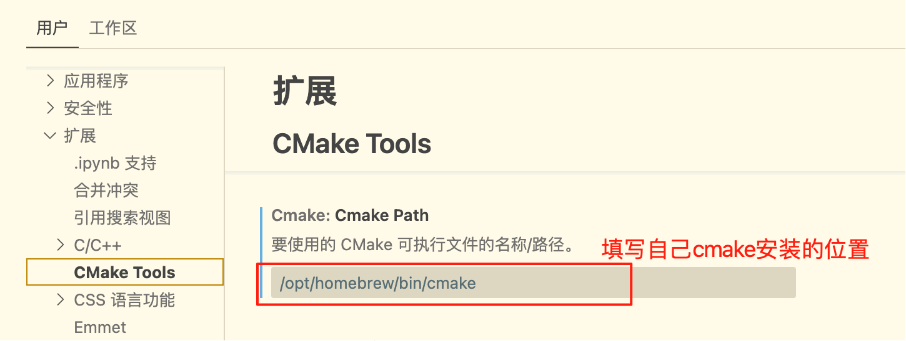

# 介绍
一个VsCode上使用CMake管理的项目模板

# 涉及的工具
- CMake项目管理
- GoogleTest单元测试
- vcpkg包管理

# VsCode所需插件
- C/C++
- C/C++ Extension Pack
- CMakeTools

# 如何使用：

## 0. 下载安装所需环境

所需环境有：

- cmake
- vcpkg
- git

安装方法自行百度，vcpkg安装之后将其安装位置添加到环境变量`VCPKG_ROOT`，例如类unix系统可以执行如下指令：

```shell
# vcpkg config
# 设置 VCPKG_ROOT 可帮助 Visual Studio Code 查找 vcpkg 实例
export VCPKG_ROOT=/Users/free152/CloneApplications/vcpkg
# 将它添加到 PATH 确保可以直接从 shell 运行 vcpkg 命令。
export PATH=$PATH:$VCPKG_ROOT
```

在vscode中关于cmake的设置：

首先安装CMakeTools插件，在设置->扩展->CMakeToos中：




## 1. clone整个项目

```git
git clone https://github.com/Free152/CMakeProjectTemplate.git
```

## 2. 修改项目名称
假如我的项目名称是“MyProject”，单元测试项目名为“MyTests”
1. 修改根目录名称为项目名称MyProject

2. 修改根目录下的CMakeLists.txt中的项目名称`project(CMakeProjectTemplate)`，改为自己的项目名

3. 修改tests目录下的CMakeLists.txt中的单元测试项目名`set(TestName "GoogleTestTemplate")`，改为自己的单元测试项目名

4. 修改launch.json中的项目名和单元测试项目名：因为cmake生成项目的名称按照第2，3步的名称生成，launch.json中的可执行文件名要与其保持一致：

   

   这里实际上是可执行文件的绝对路径，如果配置了可执行文件生成在其他地方，则这个设置需要相应修改。配置launch.json文件的目的是可以在vscode中进行可视化断点调试，以上两个配置分别对应着主项目的调试和测试项目的调试。

   

## 3. 使用vscode打开项目：


打开时弹出如下弹窗，这是`CMakePresets.json`配置的结果，点击选择这一配置，CMake可以按照配置文件预设自动配置项目。完成之后显示：


生成项目：


点击生成所有项目。

## 4. 测试是否可以正常运行

### 运行主项目：


点击运行，选择主项目，运行主项目，查看运行结果：


### 运行单元测试：


点击运行所有测试用例。

### 调试单元测试

设置断点：


将测试项目设为调试目标：


点击左下角调试按钮启动调试：


运行测试用例：


## 5. 在此基础上继续开发自己的项目

 如果测试没有问题，说明项目模板各种配置没有问题，就可以基于此项目模板进行开发了。

# 可能出现的问题：

## 1. 运行时 CMake 找不到 vcpkg 下载的动态库

出现该问题的原因一般是：“配置 CMake 使用 vcpkg 工具链”没有被正确配置，或是配置之后没有生效。

没有生效的原因是因为添加CMakePresets.json文件之后，并没有立即生效，退出vscode，重新打开项目选择该预设方式使得项目按照预设重新编译即可使其生效。

或者手动重新构建整个项目：

| **步骤**      | **命令**                      | **作用**     |
| ------------- | ----------------------------- | ------------ |
| 1. 清除旧构建 | `rm -rf build/`               | 避免缓存干扰 |
| 2. 重新生成   | `cmake --preset=dev -B build` | 应用预设配置 |

